## Backend Tech Stack
- Express
- TypeORM: orm to interface with postgres for storing user details, preferences and messages (for administrative purposes - not as memory)
- Pinecone: memory (vectorstore)
- JWT: for authentication
- GoogleGenAI: for Gemini chat model and Embeddings

## Folder Structure
- entities: typeorm db table definitions
- db: postgres + typeorm setup
- middleware: jwt secure endpoints
- routes: auth (signup/login), generate, preferences (tools to use)
- tools: mock tools
- vector: pinecone setup, embedding utilities

## Research Activity Diagram

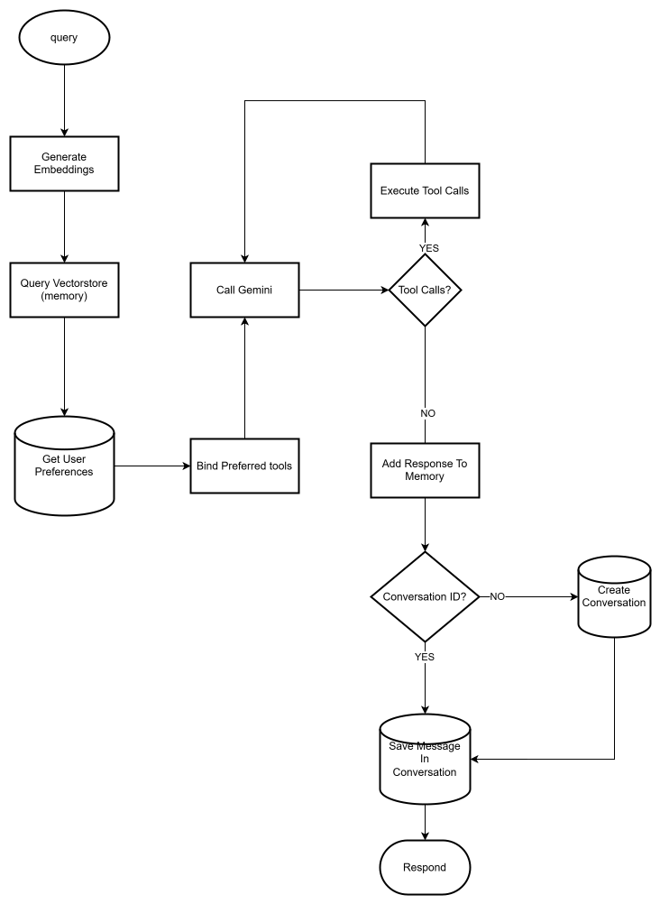

## Tests

### Signup

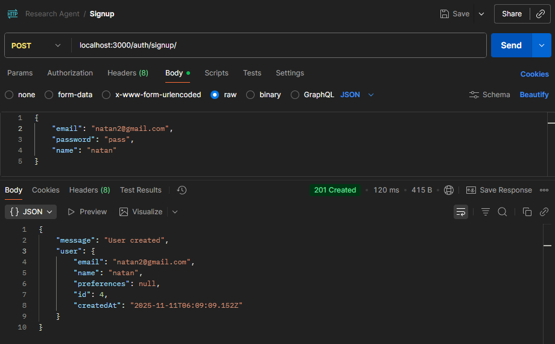

### User Exists

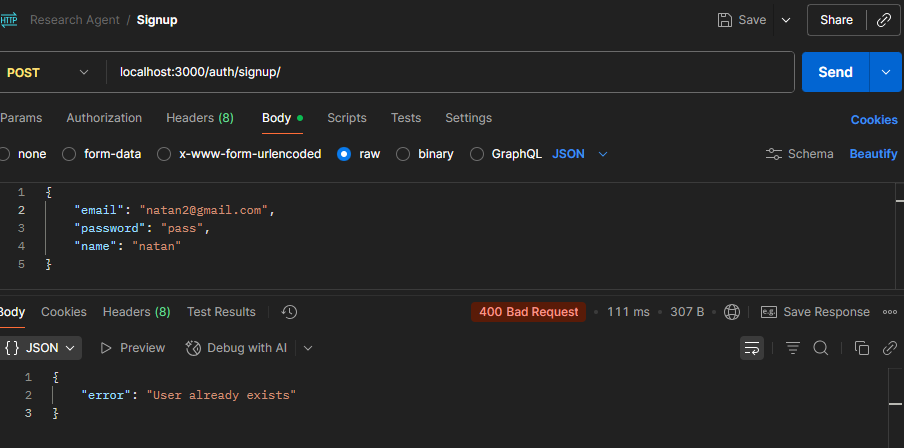

### Login

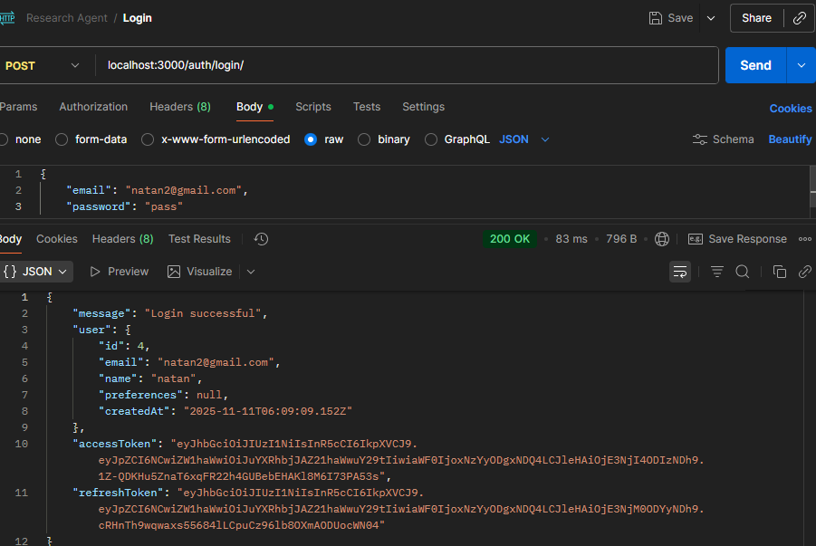

### Secure Endpoints

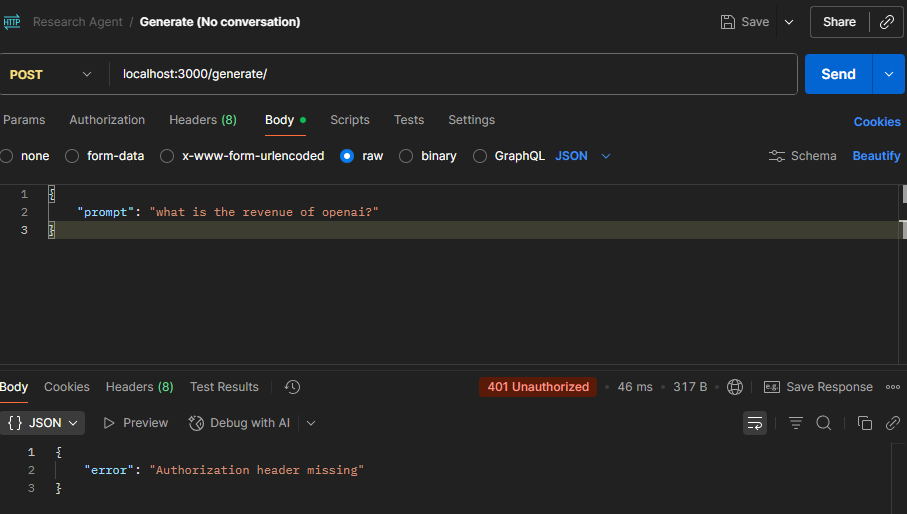

### Save Preferences

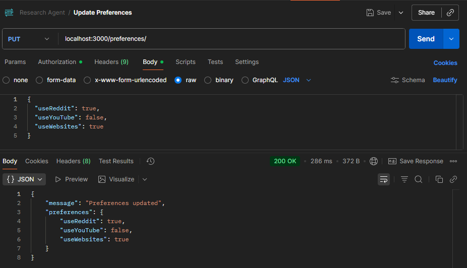

### Use Website Tool

- Mock Data
    
    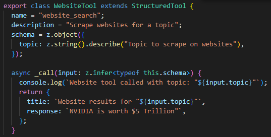

- Result

    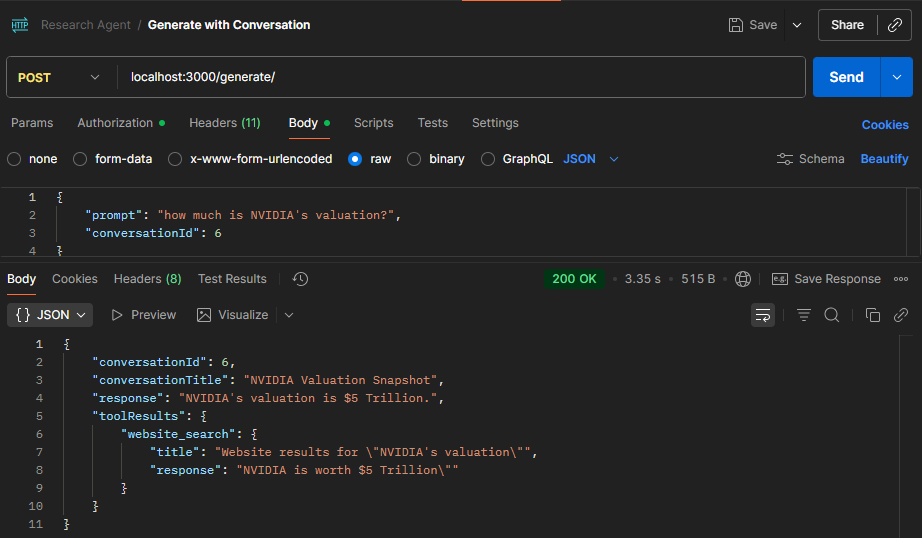

### Embedding Generation

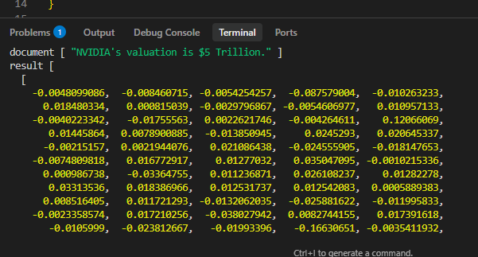

### Memory

- Pinecone setup:

    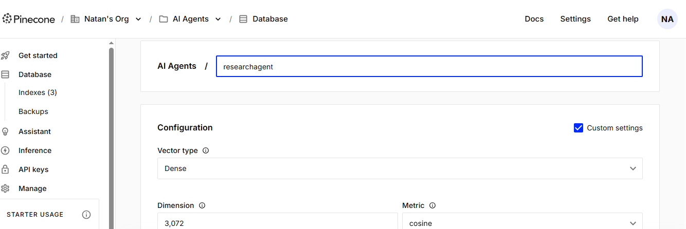

- Remove context from website tool

    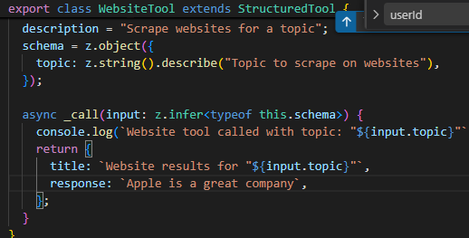

- Result from Memory

    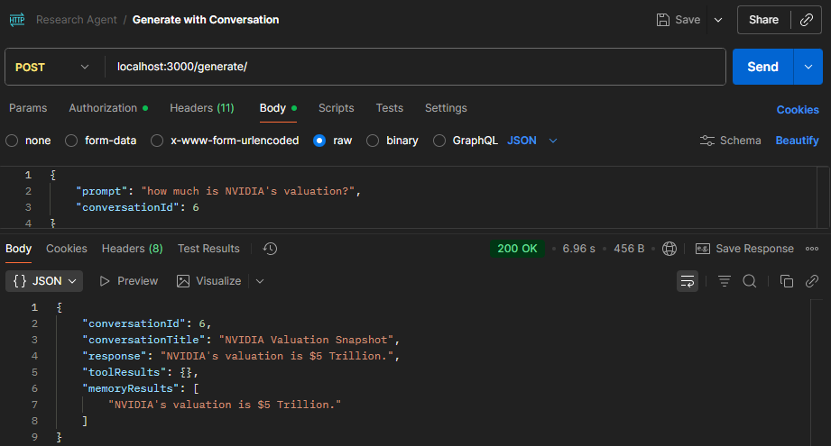